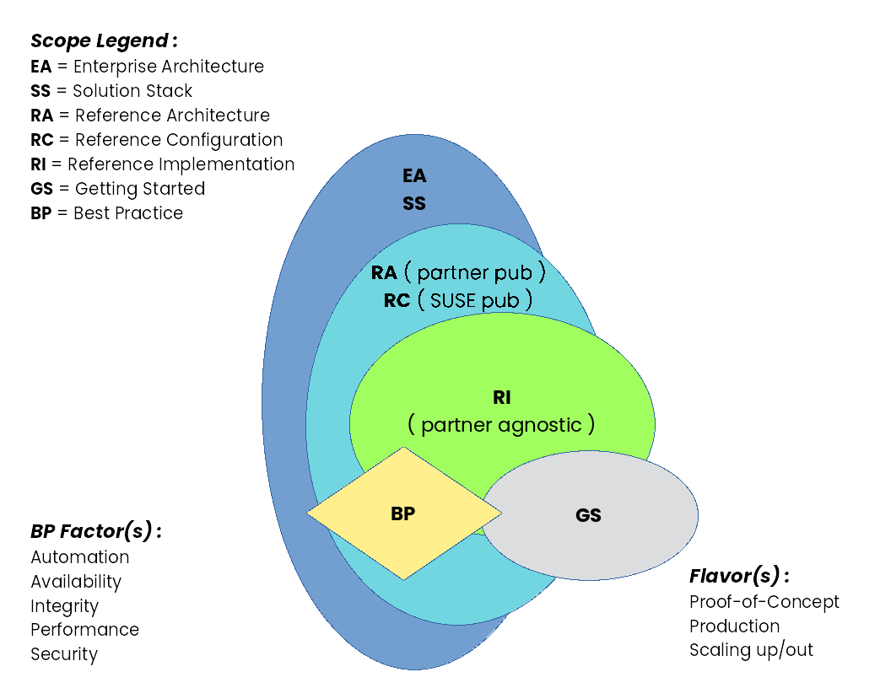

Content:
- Rancher (refer to [DC-TRD-Kubernetes-RA](./DC-TRD-Kubernetes-RA) for a general DAPS configuration template) (for SUSE Rancher, K3s)
  - see [examples](./examples) folder for various document types:
  - Getting Started
    - simplified deployment for a PoC or just to try functionality
  - Reference Implementation
    - stacked deployment of SUSE components as a basis for production
  - Reference Configuration
    - incorporate partner offerings with SUSE components for a more complete solution
- Next Up - RKE (WIP)

Output Creation:

- Assumptions
  - review tutorial - https://github.com/bwgartner/AsciiDoc-to-DAPS
  - install DocBook Authoring and Publishing Suite DAPS ( https://github.com/openSUSE/daps ) ... suggest installation of 3.1.x version or later
  - the overall template is based upon the RA flavor of Solution Architecture template ( https://github.com/bwgartner/SA-template )
- Process
  - git clone this repo (and either regularly fetch/pull to stay current)
    - many technical reference documents (TRD) can come from this repository
  - change directory to the local path where the content resides
  - determine which type of document to generate ,  see [SA-Glossary.adoc](./adoc/SA-Glossary.adoc) for descriptions
    - Getting Started (GS)
    - Reference Implmentation (RI)
    - Reference Configuration (RC) ... citing this example for the remainder
  - utilize the [Makefile](./Makefile) to generate all of the document types for all the product focus areas, with multiple layered components for whatever output format you desire:
    - ./Makefile <output-format>
      - where <output-format> = epub, html, html --single, pdf
      - then look in the generated ./build/ directory
    - note the key attributes (as shown as command like arguments in the [Makefile](./Makefile) that should be enabled for a document build (and referring to the [DC-TRD-Kubernetes-RA](./DC-TRD-Kubernetes-RA) as that catalog of all attributes)
      - ADOC_ATTRIBUTES+=" --attribute RC=1"
      - adjust/enable the focus and layer attributes
        - focusPROD : to represent the top level SUSE product
        - layersPROD : to include the respective SUSE products for the referenced layers
    - for an RC variant, you will likely also need to adjust inclusion of partner attributes (ISV, IHV, CSP)
      - e.g. for an IHV partner
        - ADOC_ATTRIBUTES+=" --attribute iIHV=1"
        - ADOC_ATTRIBUTES+=" --attribute IHV-HPE=1"
        - ADOC_ATTRIBUTES+=" --attribute IHV-HPE-Synergy=1"

Then you can progressively edit the various snippets throughout the structure that are associated ith the attributes you enable and name/value pairs and regenerate the output formats.
	

